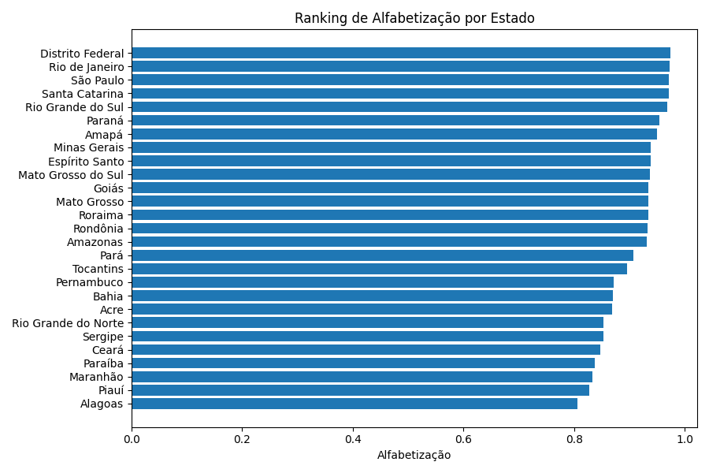
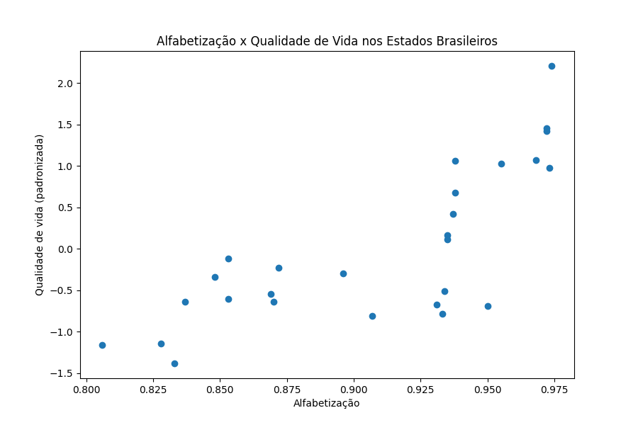
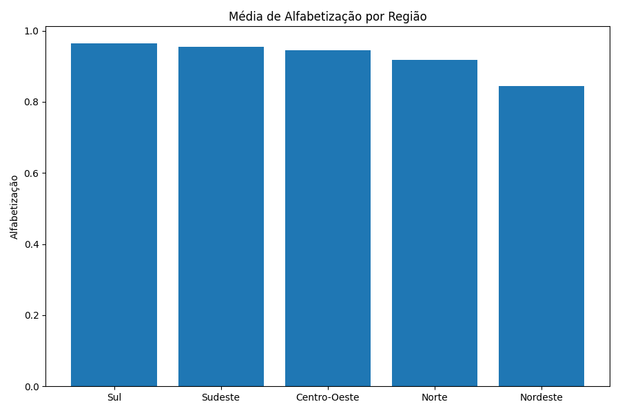
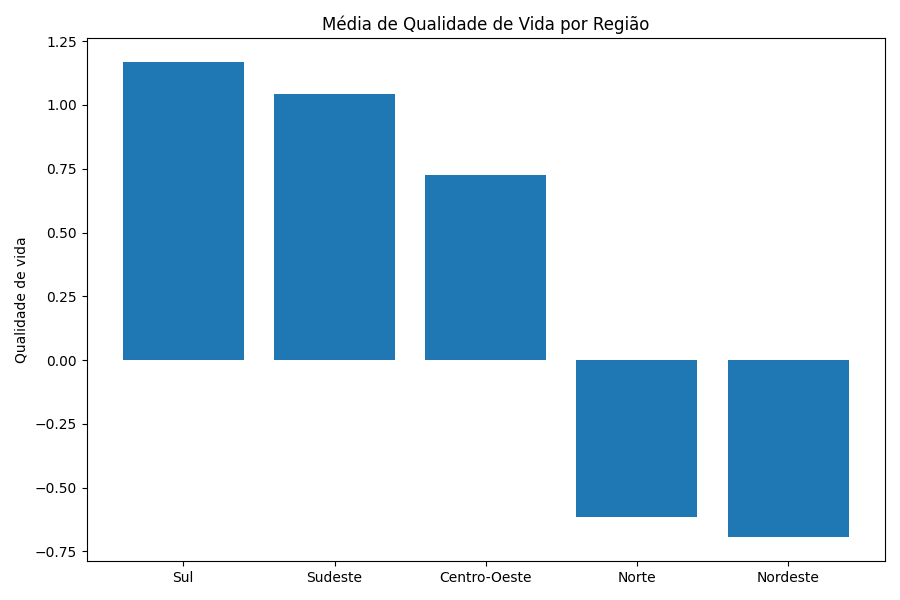

# Mini estudo socioeconômico: Educação básica x Qualidade de vida nos estados brasileiros

## Base de Dados
- **Descrição:** Conjunto de dados contendo informações socioeconômicas sobre os 27 estados brasileiros.
- **Fonte:** Wikipedia
- **Ferramenta:** Python com pandas

## Objetivo do projeto
Tentar responder se uma maior alfabetização está associada a uma melhor qualidade de vida?

## Estrutura
- data
    - states.csv
- figures
    - literacy_ranking.png
    - literacy_vs_quality.png
    - regional_literacy.png
    - regional_quality.png
- extract_clean.py
- analysis.py
- requirements.txt

## Variáveis utilizadas
1. Alfabetização: Taxa de alfabetização de 0 até 1.

2. IDH: Índice usado para avaliar a qualidade de vida e o desenvolvimento de uma população baseada em três pilares: saúde, educação e renda. Varia de 0 a 1.

3. Expectativa de vida: Estimativa do número médio de anos que moradores de cada região pode esperar viver.

4. Mortalidade infantil: Óbitos de menores de um ano por mil nascidos em cada estado.

5. PIB per capita: Produto Interno Bruto (total de bens e serviços finais produzidos) dividido pelo número de habitantes de cada estado em R$.

6. Qualidade de vida: Variável criada com base na média das variáveis 2 até 5 padronizadas (z-score).

# Análise descritiva (describe)
A análise descritiva tem como objetivo compreender a distribuição e a variabilidade das variáveis antes da aplicação dos métodos de correlação.

## Análise:
Alfabetização: A taxa média de alfabetização entre os 27 estados brasileiros é de aproximadamente 90%. O menor valor observado é 80,6% (Alagoas) e o maior é 97,4% (Distrito Federal), resultando em uma diferença de quase 17 pontos percentuais entre os extremos. O desvio padrão é de aproximadamente 5 pontos percentuais.

Sobre as demais variáveis: O IDH varia de forma moderada, sem valores extremamente baixos ou extremamente altos. A expectativa de vida possuí uma variação de cerca de 9 anos entre o mínimo (70,6) e máximo (79,1). O PIB per capita é a variável mais dispersa, embora a média seja de aproximadamente R$ 24.963, o valor máximo (R$ 73.971) é mais de seis vezes superior ao valor mínimo(R$ 11.366). A mortalidade infantil apesar de estar expressa em taxa decimal (média de 0,015), apresenta variação próxima a três vezes entre o menor e o maior valor.

## Conclusão: A análise descritiva evidencia diferenças relevantes entre os estados brasileiros nas dimensões educacionais, econômicas e sociais. O PIB per capita apresenta a maior desigualdade relativa, enquanto alfabetização, expectativa de vida e mortalidade infantil também demonstram diferenças estruturais significativas. Esses resultados indicam que o desenvolvimento não é homogêneo entre as unidades federativas.

# Correlação
Existe relação entre alfabetização e qualidade de vida?

## Análise:
Para avaliar essa relação, foi construído um índice de qualidade de vida, calculado como a média padronizada (z-score) das seguintes variáveis: IDH, expectativa de vida, PIB per capita e mortalidade infantil (invertida para manter a mesma direção interpretativa das demais).

A correlação entre alfabetização e qualidade de vida é de 0,76. O gráfico de dispersão mostra tendência crescente: estados com maiores níveis de alfabetização tendem a apresentar maiores valores no índice de qualidade de vida. 

## Conclusão:
Os resultados indicam uma associação positiva forte entre alfabetização e qualidade de vida. Embora a correlação não implique causalidade, os dados sugerem que estados com maiores níveis de educação básica tendem a apresentar melhores indicadores socioeconômicos e de desenvolvimento.

# Qualidade de vida e alfabetização por região
Comparação da educação básica e da qualidade de vida nas diferentes regiões do Brasil.

  
  

## Análise:
A região Sul apresenta a maior média de alfabetização, seguida de forma próxima por Sudeste e Centro-Oeste. Norte e Nordeste apresentam os menores valores médios. O padrão regional é idêntico para o índice de qualidade de vida: as regiões com maior alfabetização também apresentam maiores valores no índice composto.

A diferença entre a maior e a menor média regional é de aproximadamente: 0,12 (12 pontos percentuais) para alfabetização e de 1,86 unidades padronizadas para qualidade de vida.

## Conclusão:
As regiões com maiores níveis médios de alfabetização também apresentam melhores indicadores agregados de qualidade de vida. Observa-se padrão regional consistente: Sul, Sudeste e Centro-Oeste concentram os melhores resultados médios, enquanto Norte e Nordeste apresentam valores inferiores nas duas dimensões analisadas.

Esses resultados reforçam a existência de desigualdades regionais estruturais no Brasil.
